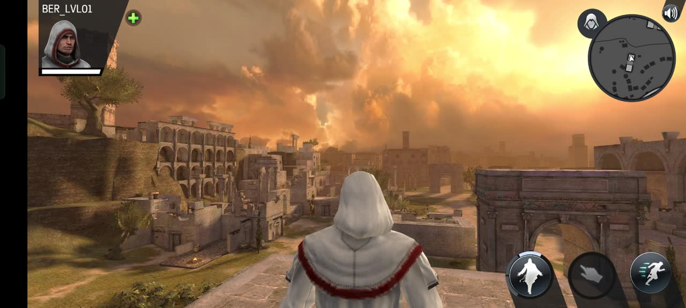
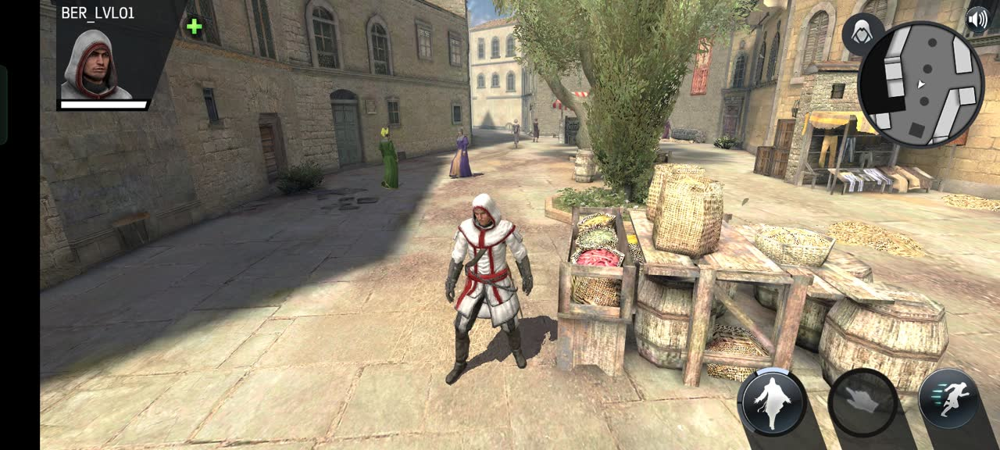
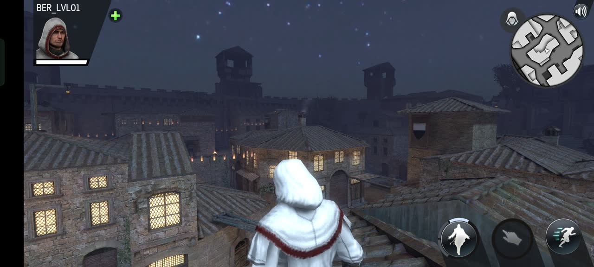
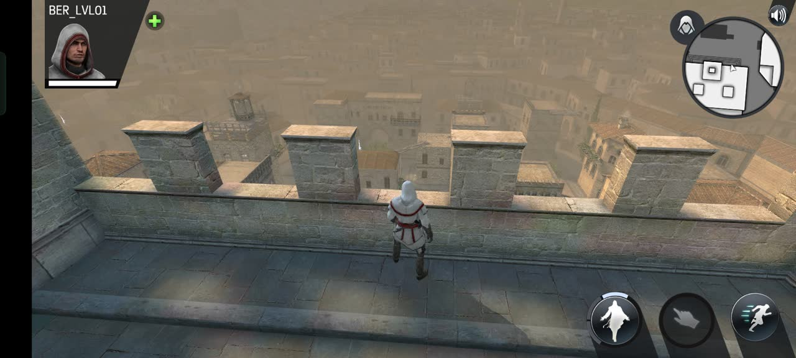
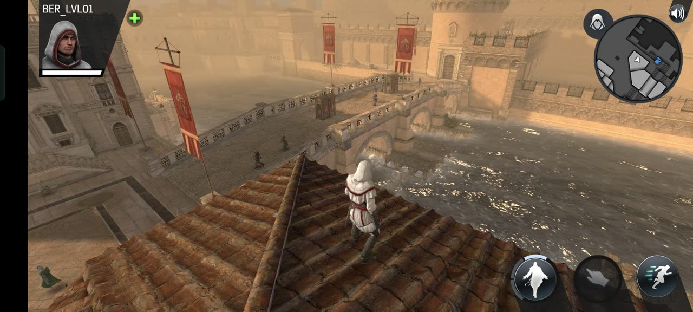
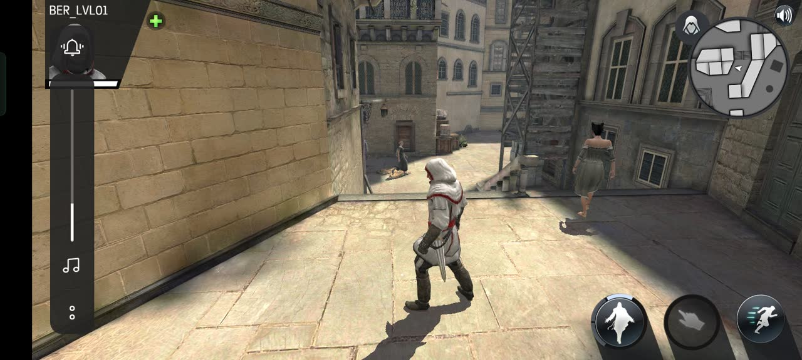
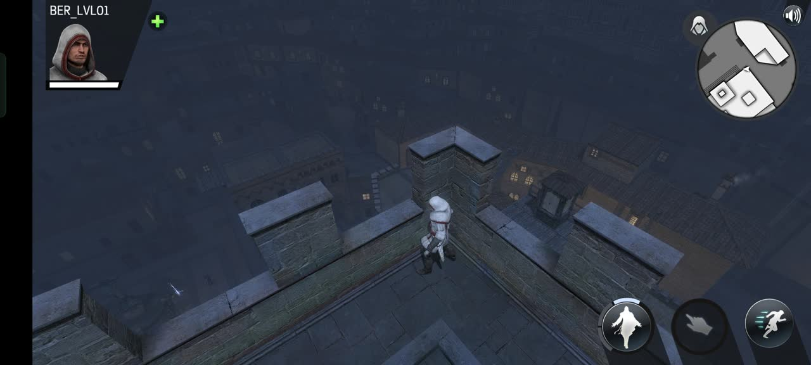

# AC Identity — Offline Revival Kit

Offline patcher + mission builder for Assassin's Creed Identity (Android).
Boot past the dead servers into the Animus hub or straight into a playable
Firenze mission with working enemy AI, combat, and death.

Proven on-device: boot → spawn → 3 guards fight back → killable, plus a
walking crowd (3 women + mercenary + 2 courtesans) and all 17 High-quality
envs live at a steady 57–59 fps. No servers.

See `GUIDE.md` for how it works, where the mission file goes, and how to
contribute. A ready-made `mission/tutorial_0001.bin` (our authoring) ships
in the repo — copy it to the device path in step 5, or rebuild your own.
`mission/missions/` holds 16 self-authored single-spawn test missions, one
per env (see GUIDE.md “Env test matrix”), plus 3 patrol versions
(`test_patrolv1/v2/v3.bin`) with walking guards (see “Patrols”).

## Demo

- Hub boot (Animus): https://github.com/CROWNZENYTH-70/acid-identity-revival/releases/download/demo-v1/demo-hub.mp4
- Tutorial loading → Firenze fight (3 guards): https://github.com/CROWNZENYTH-70/acid-identity-revival/releases/download/demo-v1/demo-fight.mp4

## Screenshots (High envs, on-device)









## What works

- Offline boot (local profile, local data URL, no Play Games sign-in)
- Animus hub boot (default) or direct-to-mission boot (`freeroam` flag).
  Note: the hub itself has nothing working except Settings — it is a
  boot proof, not gameplay. Playable content is the Firenze mission.
- Custom `tutorial_0001.bin` mission: player spawn + 3 live enemies
  (papal guard, guard captain, crossbowman) with precache → behavior tree →
  stats → attack
- Patrols: guards walk beats via `MissionNpcFormation` + waypoint children
  (loop, multi-point beat, standing-watch halt all verified on-device;
  they detect and attack off-route, unlike the old idle statues).
  See `mission/missions/test_patrolv3.bin` + GUIDE.md “Patrols”
- 60 fps mission cap (was 25), navmesh spawn snap, ETC2 texture lock
- Crowd alive: bad-pick null-skip, live-guid pool (3 women + mercenary +
  5 males + 2 courtesans, all verified walking on-device), stays enabled
  during missions, crowd quality 0.8, density 40 / max 20
- High envs: all 17 High bundles live on-device (17/17 scenes boot, zero
  crashes), swapped under the Low cache UID + catalogue size patch —
  including palazzo *nighttime* (UID `2b03ed47-...`, found unmapped in the
  MEGA dump, size byte-exact vs dict; see `GUIDE.md` + `tools/high_env_uids.txt`)
- Presentation: full-res (downscaling off), BumpedSpecular shaders (LOD 400),
  Unity tier 5, 2x MSAA, 15 m stable shadows — steady 57–59 fps
- 4 real gameplay fixes: mission-guid → live NPC alias, lone-NPC
  formation null-check, Parcour cover null-guards, empty-mission
  objective-tracker guard

## Requirements

- Your own AC Identity APK + its `AcierData` cache (not included, never will be)
- `apktool`, `apksigner`, `keytool`, `dotnet` 8 SDK (apktool/keytool need Java)
- Android device for install + `ACID_Revival/` folder on shared storage

## Build

```bash
# 1. decode your APK
apktool d ACIdentity.apk -o apk_dec

# 2. patch (default = hub boot; pass freeroam for direct-to-mission)
dotnet run --project patch -- "$PWD/apk_dec/assets/bin/Data/Managed" \
  "$PWD/work/Assembly-CSharp.dll" hub
# freeroam variant:
# dotnet run --project patch -- "$PWD/apk_dec/assets/bin/Data/Managed" \
#   "$PWD/work/Assembly-CSharp.dll" freeroam

# 3. rebuild + sign (first time: create YOUR keystore, keep it private)
mkdir -p work work/Missions
cp work/Assembly-CSharp.dll work/SharedBaseLib.dll apk_dec/assets/bin/Data/Managed/
apktool b apk_dec -o work/ACID-revival-unsigned.apk
cp work/ACID-revival-unsigned.apk work/ACID-revival.apk
keytool -genkeypair -keystore work/revival.keystore -storepass CHANGE_ME \
  -alias acid -keypass CHANGE_ME -keyalg RSA -keysize 2048 \
  -validity 10000 -dname "CN=ACID Revival"
apksigner sign --ks work/revival.keystore --ks-pass pass:CHANGE_ME \
  --ks-key-alias acid --key-pass pass:CHANGE_ME work/ACID-revival.apk
apksigner verify work/ACID-revival.apk

# 4. mission (edit spawn/guids in mission/Program.cs first)
dotnet run --project mission \
  -p:ManagedDir="$PWD/apk_dec/assets/bin/Data/Managed" \
  -- work/Missions/tutorial_0001.bin
# usage: mission <out.bin> [scene] [region] [age] [mood] [--no-guards]
# defaults build the main Firenze mission; e.g. a guard-less Forli test:
# dotnet run --project mission -p:ManagedDir="$PWD/apk_dec/assets/bin/Data/Managed" \
#   -- work/Missions/test_forli_dusk.bin Forli_dusk Forli Italy Dusk --no-guards
```

Install the APK, push the mission to
`/storage/emulated/0/ACID_Revival/AcierData/Missions/tutorial_0001.bin`,
launch. Crash/error log (only on real errors) lands at
`/storage/emulated/0/ACID_Revival/boot.log`.

## Legal

Bring your own APK and data. This repo contains only our patcher and mission
authoring code — no Ubisoft binaries, assets, or caches.
